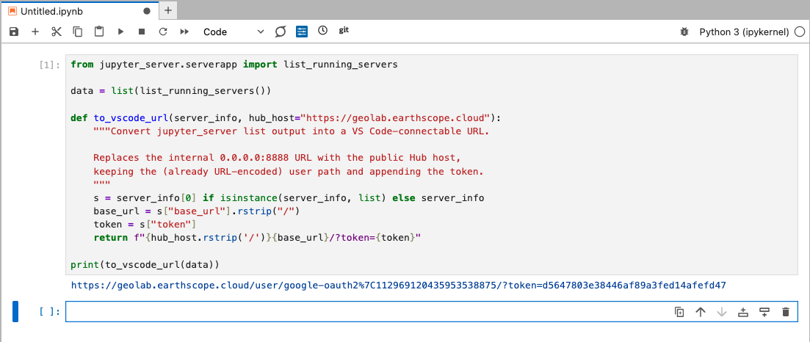
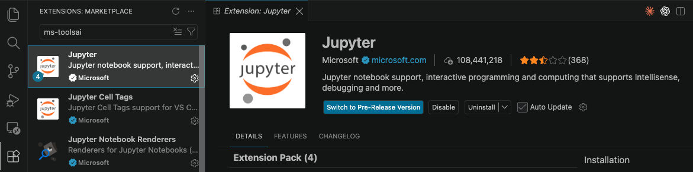
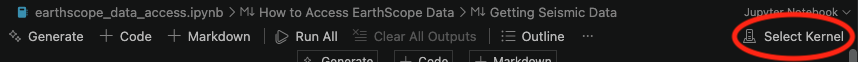
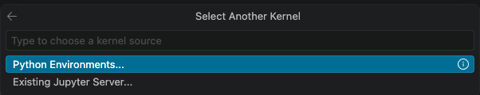
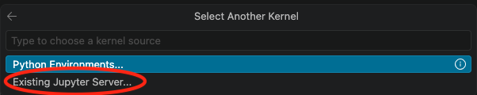
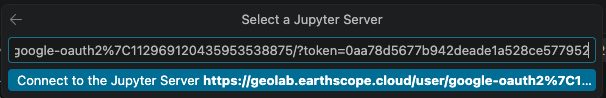
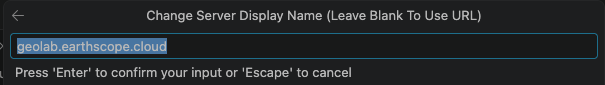
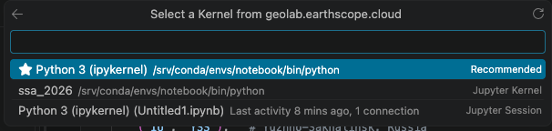

# Connecting VS Code to a GeoLab Jupyter Instance

This guide covers both sides of the connection: getting a usable server URL
from inside GeoLab (the **Jupyter side**), and attaching your local VS Code to
that server (the **VS Code side**).

GeoLab runs on a 2i2c-managed JupyterHub on Kubernetes. Each user gets a pod
with its own single-user Jupyter server behind the Hub proxy. VS Code connects
to that per-user server URL over HTTPS — there is no SSH into the pod, and no
special "proxy" extension is needed.

---

## Prerequisites

On your laptop:

- **VS Code**
- **Jupyter extension** (`ms-toolsai.jupyter`)
- **Python extension** (`ms-python.python`) — installed automatically as a dependency of the Jupyter extension

In GeoLab:

- A **running server**. Log in at `https://geolab.earthscope.cloud` and start
  your server so the pod is alive before you try to connect. If the pod is
  culled or stopped, the URL and token become invalid.

---

## Jupyter side: get a connectable URL

The `url` field reported by Jupyter points at `0.0.0.0:8888`, which is the
pod-internal address and is not reachable from your laptop. You need to rebuild
the URL against the public Hub host and append the server token.

Open a notebook in your running GeoLab server and run this in a cell:

```python
from jupyter_server.serverapp import list_running_servers

data = list(list_running_servers())

def to_vscode_url(server_info, hub_host="https://geolab.earthscope.cloud"):
    """Convert jupyter_server list output into a VS Code-connectable URL.

    Replaces the internal 0.0.0.0:8888 URL with the public Hub host,
    keeping the (already URL-encoded) user path and appending the token.
    """
    s = server_info[0] if isinstance(server_info, list) else server_info
    base_url = s["base_url"].rstrip("/")
    token = s["token"]
    return f"{hub_host.rstrip('/')}{base_url}/?token={token}"

print(to_vscode_url(data))
```

This prints a line like:

```
https://geolab.earthscope.cloud/user/google-oauth2%7C112969120435953538875/?token=0f22dabff13f4ad48a45fe1ebebcc105
```

Copy that entire line — you will paste it into VS Code in the next section.



### Notes on the URL

- The `%7C` in the path is an already-encoded `|` (pipe) from your OAuth2 user
  ID. Leave it as-is. Do not re-encode it, or it becomes `%257C` and the path
  breaks.
- The token identifies your session. Treat it like a password and do not commit
  it or share it.
- If the token comes back empty or VS Code later rejects it, request a Hub API
  token instead: go to `https://geolab.earthscope.cloud/hub/token`, click
  **Request new API token**, and substitute that value for the `token` in the
  URL.

---

## VS Code side: connect to the server

1. Install the **Jupyter** extension (`ms-toolsai.jupyter`) from the Extensions
   view if you have not already.



2. Open or create a notebook file (`.ipynb`) in VS Code.

3. Click the **kernel picker** in the top-right of the notebook (it may read
   "Select Kernel").



4. Choose **Select Another Kernel...**



5. Choose **Existing Jupyter Server...**



6. Choose **Enter the URL of a running Jupyter server**.



7. Paste the full tokenized URL you copied from GeoLab, including the
   `?token=...` part, then press Enter.

8. When prompted, accept or edit the display name for the server.



9. Back in the kernel picker, select the kernel exposed by the remote server
   (for example, the Python 3 kernel from your GeoLab environment).



10. Run a cell to confirm. Execution now happens inside your GeoLab pod, using
    the GeoLab environment and compute — not your laptop.

---

## Verifying you are on the remote kernel

Run this in a cell. It should report the pod's paths and hostname, not your
laptop's:

```python
import sys, socket, os
print("hostname:", socket.gethostname())
print("python:  ", sys.executable)
print("cwd:     ", os.getcwd())
```

On GeoLab you should see something like a `jupyter-...` hostname, a Python
executable under `/srv/conda/` or similar, and a working directory of
`/home/jovyan`.

---

## Troubleshooting

**"Cannot connect" or the connection times out.**
The most common cause is that your server is not running. Open the URL in a
browser first to spin up / confirm the pod, then retry in VS Code.

**Token rejected.**
The single-user server token is sometimes empty or not accepted through the Hub
proxy. Use a Hub API token from `https://geolab.earthscope.cloud/hub/token`
instead, and rebuild the URL with it.

**Path looks wrong (404).**
Confirm the `/user/<id>/` segment matches exactly what appears in your browser's
address bar while you are in JupyterLab. Do not manually decode the `%7C`.

**Connection worked earlier, now fails.**
Hub servers get culled after inactivity. When the pod restarts, the URL and/or
token change. Re-run the snippet on the Jupyter side to get a fresh URL.

**Looking for a "jupyter-server-proxy" VS Code extension.**
There isn't one, and you do not need it. `jupyter-server-proxy` is a
server-side package for proxying other web apps (like the Dask dashboard)
through the Hub; it plays no role in the VS Code connection. The Jupyter
extension talks to the server URL directly.
