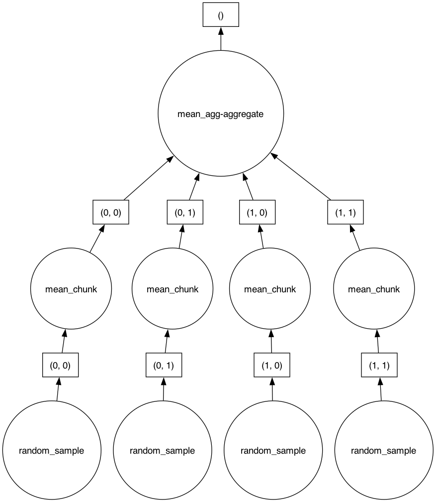

# Introduction to Dask

(why-scientists-use-dask)=
## 1. Why Scientists Use Dask

Many research projects use large amounts of data. A seismologist can have years of continuous ground-motion data from hundreds of sensors. A climate scientist can have decades of satellite images. A genomics researcher can have millions of DNA sequences to compare.

Three problems occur frequently:

1. **The data does not fit in memory.** When working on analyses ranging from dozens of gigabytes to petabyte-scale, a user cannot load all the data at the same time.
2. **The analysis takes too much time.** Even when the data fits in memory, a calculation on all the data, one step at a time, can take hours or days.
3. **The GeoLab instance does not have enough resources.** Some tasks are too large for a single powerful environment to complete in a reasonable time.

Dask helps solve these three problems:

- Dask can process data **in chunks**. Dask moves pieces of data through memory instead of loading all the data at the same time.
- Dask can use **every core available on a GeoLab instance** at the same time, instead of one core at a time.
- Dask can spread work **across many separate computers** connected on a network in the cloud. The computers operate together like one large computer.

---

(what-is-dask)=
## 2. What Is Dask?

Dask is a python tool that helps with the orchestratration large tasks. Dask takes one large task and divides the task into smaller tasks that can execute in parallel to complete the task with fewer or limited resources.

Dask uses the same commands as `numpy`, `pandas`, and standard Python functions. Users do not have to learn a new programming method to get these benefits. Users write standard Python code. Dask divides the work and runs the work efficiently.

Dask gives users two types of tools:

- **Dask Array** divides a large array into smaller pieces and works like `numpy`. **Dask DataFrame** divides a large table into smaller pieces and works like `pandas`. NumPy is a tool for large groups of numbers. Pandas is a tool for tables of data. Dask Array and Dask DataFrame can process data too large for GeoLab's memory.
- **Dask Delayed** builds a plan for a custom Python function before running it. **Dask Futures** runs a custom Python function immediately and returns a handle to the result. Both let users run their own Python functions at the same time.

### The Task Graph

Dask represents a large task as a **task graph** instead of running the task immediately. A task graph has two parts:

- **Nodes.** A node represents one small task, for example one calculation on one piece of data.
- **Edges.** An edge represents a dependency between two tasks. An edge connects a task to the earlier task that the task needs.

Dask builds the task graph first and runs the task graph later. This method is called **lazy evaluation**. For example, when a user creates a large Dask Array or Dask DataFrame, Dask does not process any data yet. Dask records one node for each piece of the array or table. When the code calls a method, for example `.mean()`, Dask adds more nodes to the graph: one node for each partial result, and one final node that combines the partial results. [Section 10](#full-example) shows this pattern with a concrete example: one node for every 5,000 x 5,000 chunk of a 100,000 x 100,000 array, plus the nodes that combine the chunks into the final mean and standard deviation.

The image below shows the task graph for `mean_value` on a small array split into 4 chunks, drawn with `mean_value.visualize()`. Each `random_sample` node creates one chunk, each `mean_chunk` node calculates the mean of one chunk, and the single `mean_agg-aggregate` node at the top combines the partial means into the final result.



Dask does not run any node in the graph until the code calls `.compute()` or `.persist()`. At that point, Dask sends the complete task graph to a **scheduler**. The scheduler finds every node with no unfinished dependency and assigns that node to an available **worker** ([Section 4](#dask-distributed) describes workers). A worker runs its assigned node and returns the result to the scheduler. When a node's dependencies are all finished, the scheduler marks that node as ready and assigns the node to a worker. This process repeats until every node in the graph is complete.

Because two independent nodes have no edge between them, the scheduler can assign the two nodes to two different workers at the same time. This is why Dask can process many pieces of one large task in parallel.

---

(local-dask)=
## 3. Local Dask: Using GeoLab's Resources

The Dask local scheduler is the simplest way to use Dask in GeoLab. This code creates a local instance of Dask:

```python
from dask.distributed import Client
import dask

client = Client()

# A simple Python function.
def square_it(n):
    return n * n

# dask.delayed() wraps the function call in a task instead of running it right away.
# Dask does not run square_it() yet -- this line only builds a plan.
delayed_result = dask.delayed(square_it)(10)

# .compute() sends the task to the local workers and returns the result.
result = delayed_result.compute()
print(result)   # 100
```

The `dask.distributed` package provides Dask's client, scheduler, and worker system. This package creates a cluster whether the cluster is local, as in this section, or spread across many machines, as [Section 4](#dask-distributed) describes. The package name stays the same in both cases.

Dask starts workers on the cores available in GeoLab. For example, if GeoLab gives a user 4 CPU cores, Dask can create workers to use all these cores at once. Each worker completes tasks at the same time.

### When to Use Local Dask

Use local Dask for these tasks:

- **Learn Dask and test code.** Users can try Dask commands and measure the increase in speed on a small scale before they run larger tasks.
- **Process a dataset larger than the available memory, but not much larger.** Dask can process data in chunks and prevent memory errors, even without extra machines.
- **Complete routine analysis tasks** when GeoLab has enough resources, for example, an environment with 32 or 64 cores.

### Limits of Local Dask

A local Dask cluster depends on the hardware available to it. If a dataset needs 500 gigabytes of memory and hundreds of cores to finish in a reasonable time, GeoLab cannot support the task. In this case, use distributed Dask.

---

(dask-distributed)=
## 4. Dask Distributed: Using Many Computers at Once

**Dask Distributed** uses the same method as local Dask, but on a larger scale. This document uses "Dask Distributed" as the name for a cluster spread across many machines. This name is different from `dask.distributed`, the Python package name. [Section 3](#local-dask) already used the `dask.distributed` package to create a local cluster; the same package creates a cluster whether the cluster is local or spread across many machines.

Dask Distributed has three parts:

- **Scheduler**: The scheduler decides which worker completes each task in the task graph. The scheduler also tracks which tasks are complete.
- **Workers**: Workers run the calculations. Each worker can be a virtual machine, a container, or a server.
- **Client**: The client is the Python code that the user writes in a notebook. The client sends requests to the scheduler and receives the results.

When using Dask Distributed, workers do not stay on one machine. Workers can operate on many separate machines across a cloud network. The local machine (in this case, your GeoLab instance) operates as the control center and pushes individual, independent tasks out to the other machines across the network. 

Workers can operate on many physical machines in a data center. As a result, a distributed Dask cluster can have more memory and more processing power than one computer. A distributed cluster can have hundreds or thousands of cores and terabytes of memory.

### When to Use Distributed Dask

Use distributed Dask for these tasks:

- **Process very large datasets** that overwhelm a single computer.
- **Support multiple users at the same time.** Distributed Dask lets many users in a classroom or a laboratory share the same pool of computing power at once. GeoLab uses this method (refer to [Section 6](#geolab)).
- **Complete time-sensitive research.** A job that runs on 50 workers instead of 1 computer can change a multi-day task into a multi-hour task.

### Limits of Distributed Dask

Distributed computing has costs:

- **Starting workers** can take seconds to several minutes.
- **Moving data across a network** is slower than moving data within one computer.
- **Cost.** Cloud computing resources cost money for each hour of operation.

Because of these costs, a distributed cluster can operate slower than a local instance for small tasks. The time to set up a cluster and the time to move data over the network can take longer than the task itself.

---

(local-vs-distributed)=
## 5. Local vs. Distributed: Which One Should You Use?

| | **Local Dask** | **Dask Distributed** |
|---|---|---|
| Location of workers | GeoLab's own cores | Many machines, frequently in the cloud |
| Setup time | Almost instant | Seconds to a few minutes (workers must start) |
| Maximum job size | Limited by one machine | Can scale to very large jobs |
| Cost | No cost (part of GeoLab) | Frequently costs money or uses shared resources |
| Best use | Learning, small-to-medium data, quick analysis | Large datasets, shared classroom or lab computing, time-critical jobs |

**Rule:** start with local Dask. Test the code on a small part of the data. Confirm that the logic is correct. Confirm that the task is too large or too slow for GeoLab's local resources before switching to a distributed cluster to scale up the task. This method prevents users from spending cloud computing time to debug a simple error.

---

(geolab)=
## 6. Connect to Dask Distributed in GeoLab

GeoLab is a cloud-based JupyterHub platform, built in partnership with 2i2c. GeoLab gives researchers access to a shared pool of computing resources. A user can request a **Dask Gateway cluster** instead of running Dask only locally in a GeoLab session. A Dask Gateway cluster is a group of additional worker machines that run on shared AWS cloud infrastructure. A user can connect to the cluster from a notebook.

The `dask_gateway` package manages requests for a distributed Dask cluster.

### Procedure: Connect in GeoLab

**Step 1: Connect to the Gateway.** The `Gateway` object connects to the GeoLab cluster management system.

```python
from dask_gateway import Gateway

# GeoLab is already configured for the Gateway.
# Users do not need to enter addresses or passwords.
gateway = Gateway()
```

**Step 2: Show the available cluster options (optional).** GeoLab lets users select settings, for example, the amount of memory for each worker.

```python
options = gateway.cluster_options()
options   # Shows an interactive form of cluster settings in Jupyter
```

**Step 3: Create or reuse a cluster.** This step reserves worker machines for the user. Check if a cluster is already running before you start a new cluster. If you do not check, you can create more than one cluster and pay for computing resources that you do not use.

```python
clusters = gateway.list_clusters()

if clusters:
    # Reuse a cluster that started earlier
    cluster = gateway.connect(clusters[0].name)
    print(f"Connected to existing cluster: {clusters[0].name}")
else:
    # No cluster exists, so create a new cluster
    cluster = gateway.new_cluster()
    # adapt() tells Dask to increase or decrease the number
    # of workers between 2 and 10, based on the workload
    cluster.adapt(minimum=2, maximum=10)
    print("Created new cluster")
```

**Step 4: Get a client connected to the cluster.** The client sends the user's Python code to the cluster.

```python
client = cluster.get_client()
client   # Shows a summary: number of workers, cores, memory, dashboard link
```

The client widget includes a link to the **Dask dashboard**. The dashboard is a live, browser-based view of task execution, worker activity, and memory use. Use the dashboard to understand how a computation runs, not only whether it finished. For more information about the dashboard, refer to the [Dask dashboard documentation](https://docs.dask.org/en/stable/dashboard.html).

**Step 5: Wait for the workers to start (optional).** Workers can take time to start. A new cluster takes more time to start than an existing cluster. Wait until at least two workers are ready before you send more tasks.

```python
client.wait_for_workers(n_workers=2)
```

**Step 6: Run the analysis.** After the client connects, Dask automatically sends the work to the distributed cluster instead of the local instance. This applies to any code that uses Dask Array, Dask DataFrame, `delayed`, or `client.map`.

See below for concrete examples on setting up your analysis.

**Step 7: Close the cluster.** When the task is complete, close the cluster. This action releases the shared computing resources for other users.

```python
client.close()
cluster.close()   # Necessary only if you created your own Gateway cluster
```

---

(dask-dataframe)=
## 7. Dask DataFrame

[Section 6](#geolab) connects a client to a distributed cluster. This section and the next two sections show how to use that client. Dask DataFrame, Dask Futures, and `.persist()` each send work through the same client to the same cluster.

A Dask DataFrame divides one large table into many smaller pandas DataFrames. Dask calls each smaller table a **partition**. Dask can process each partition separately.

Use a Dask DataFrame for tabular data too large for the available memory, for example a table with millions of rows.

```python
import numpy as np
import pandas as pd
import dask.dataframe as dd

# Create a pandas DataFrame with example data.
station_data = pd.DataFrame({
    "station": np.random.choice(["STA01", "STA02", "STA03", "STA04"], size=200_000),
    "amplitude": np.random.random(200_000),
})

# Convert the pandas DataFrame into a Dask DataFrame with 8 partitions.
ddf = dd.from_pandas(station_data, npartitions=8)

# This calculation is lazy. Dask does not run it yet.
mean_amplitude = ddf.groupby("station")["amplitude"].mean()

# .compute() runs the calculation and returns a pandas result.
result = mean_amplitude.compute()
print(result)
```

A Dask DataFrame can also read data directly from files, instead of from an existing pandas DataFrame. Two common methods are:

```python
ddf = dd.read_csv("data/station-observations-*.csv")
ddf = dd.read_parquet("data/station-observations/")
```

Dask reads only the file metadata at first. Dask reads each partition only when the code calls `.compute()` or `.persist()`.

---

(dask-futures)=
## 8. Dask Futures

Dask Delayed builds a complete task graph before any task runs. Dask Futures use a different method: the code sends each task to the scheduler immediately, instead of building the complete graph first.

Use Dask Futures when the workflow does not know every task in advance, or when the workflow must act on each result as soon as it finishes, instead of waiting for every result together.

These examples reuse a small function that squares a number:

```python
def square_it(n):
    return n * n
```

The `client.submit()` method sends one task to the scheduler and returns a **Future** immediately. A Future represents a task that is pending, running, or finished.

```python
# Submit one task and receive a Future immediately.
future = client.submit(square_it, 10)

print(future.status)   # for example, "pending" or "finished"

result = future.result()   # Waits for the task and returns its value
print(result)
```

To submit the same function across many inputs, use `client.map()`:

```python
numbers = list(range(20))
futures = client.map(square_it, numbers)
```

To collect every result at the same time, use `client.gather()`:

```python
results = client.gather(futures)
```

To process each result as soon as it finishes, instead of waiting for every result, use `as_completed()`:

```python
from dask.distributed import as_completed

for finished in as_completed(futures):
    result = finished.result()
    print(result)
```

| | **Dask Delayed** | **Dask Futures** |
|---|---|---|
| Execution | Lazy: builds a task graph first | Eager: sends each task immediately |
| Requires | `.compute()` to run the graph | An active client |
| Best use | A workflow the user can define completely in advance | A workflow that changes while it runs, or that needs results as they finish |

**Example:** A seismologist has 500 known station files and needs the same processing step, for example a bandpass filter, applied to every file. The full list of files and the full set of tasks are known before the code runs, so **Dask Delayed** fits this workflow: the code builds one task graph for all 500 files and calls `.compute()` once.

A different seismologist searches an earthquake catalog for events above a magnitude threshold during a large earthquake sequence. New events can appear while the search runs, and the seismologist wants to start downloading and processing each event's waveform data as soon as the catalog returns it, instead of waiting for the full catalog search to finish. **Dask Futures** fits this workflow: the code submits a task for each event as the event appears, and `as_completed()` processes each waveform as soon as its download finishes.

---

(compute-vs-persist)=
## 9. Compute vs. Persist

Two methods run a Dask task graph: `.compute()` and `.persist()`. The methods store the result in different places.

- `.compute()` runs the task graph and returns the final result to the notebook, as a standard Python, NumPy, or pandas object. Use `.compute()` for a small final result.
- `.persist()` runs the task graph and keeps the result in the workers' memory, as a Dask object. Use `.persist()` when the workflow reuses the same intermediate result more than once.

```python
from dask.distributed import wait

# Build a lazy intermediate result.
filtered = ddf[ddf["amplitude"] >= 0.5]

# persist() starts the calculation now and stores the result on the workers.
filtered = filtered.persist()

# wait() pauses until every partition finishes.
wait(filtered)

# A later calculation reuses the persisted result without repeating the filter.
mean_result = filtered["amplitude"].mean().compute()
```

| Method | Result location | Returned object | Best use |
|---|---|---|---|
| `.compute()` | The notebook | A Python, NumPy, or pandas object | A small, final result |
| `.persist()` | Worker memory | A Dask object | An intermediate result the workflow reuses |

**Example:** A seismologist filters a large continuous ground-motion dataset down to only the high-amplitude events. The seismologist then plans to calculate several statistics from that same subset, for example the mean amplitude, the maximum amplitude, and the number of events. Because the workflow reuses the filtered subset more than once, **`.persist()`** fits this workflow. The code above already shows this pattern: `filtered` is persisted once, and the later mean calculation reuses the persisted result instead of re-filtering the full dataset from scratch.

A different seismologist runs one calculation, the mean amplitude across an entire station's data, to decide whether the station needs further investigation. The workflow needs only that one small number, and nothing later in the notebook reuses the intermediate result. **`.compute()`** fits this workflow better: it returns the final mean directly to the notebook as a standard Python value, without keeping a Dask object in worker memory.

---

(full-example)=
## 10. A Full Working Example

This example shows a complete procedure that a user can run in GeoLab. The procedure connects to a distributed cluster, creates a large array of random numbers, calculates statistics on the array, and closes the cluster. The comments in the code explain each step.

```python
# ------------------------------------------------------------------
# 1. Connect to GeoLab's distributed Dask cluster through the Gateway
# ------------------------------------------------------------------
from dask_gateway import Gateway

gateway = Gateway()  # Connects to GeoLab's shared Dask cluster manager automatically

clusters = gateway.list_clusters()

if clusters:
    # Reuse an existing cluster if one is available
    cluster = gateway.connect(clusters[0].name)
    print(f"Connected to existing cluster: {clusters[0].name}")
else:
    # Request a new cluster
    cluster = gateway.new_cluster()
    # Let the cluster scale automatically between 2 and 6 workers
    # based on the workload
    cluster.adapt(minimum=2, maximum=6)
    print("Created new cluster")

# The client sends work to the cluster
client = cluster.get_client()

# Confirm at least 2 workers are ready before the task starts
client.wait_for_workers(n_workers=2)
print(client)  # Shows a summary: number of workers, total cores, total memory

# ------------------------------------------------------------------
# 2. Create a large dataset with Dask Array
#    (this array is too large for GeoLab's memory,
#     but Dask processes the array in chunks)
# ------------------------------------------------------------------
import dask.array as da

# Create a 100,000 x 100,000 array of random numbers.
# This array has 10 billion numbers. Dask divides the array into
# chunks of 5,000 x 5,000 to process the array piece by piece.
x = da.random.random((100_000, 100_000), chunks=(5_000, 5_000))

print(x)  # Dask does not calculate the array yet -- Dask creates a plan
          # (this method is called "lazy evaluation")

# ------------------------------------------------------------------
# 3. Run the calculations
#    Dask does not run a calculation on the cluster until the code
#    calls .compute() or .persist() -- before this step, Dask only
#    builds the task graph
# ------------------------------------------------------------------
mean_value = x.mean()          # still only a plan at this point
std_value = x.std()            # still only a plan at this point

# .compute() sends the task graph to the scheduler. The scheduler
# assigns the work to the workers on the cluster, then collects
# the final result
result_mean = mean_value.compute()
result_std = std_value.compute()

print(f"Mean:  {result_mean:.4f}")
print(f"Stdev: {result_std:.4f}")

# ------------------------------------------------------------------
# 4. Run a custom function on many pieces of data with
#    client.map() -- use this method when the calculation is not
#    a simple array or dataframe operation, but a custom Python function
# ------------------------------------------------------------------
def square_it(n):
    return n * n

numbers = list(range(20))
futures = client.map(square_it, numbers)   # Sends 20 tasks to the cluster
results = client.gather(futures)           # Collects the results

print(results)  # [0, 1, 4, 9, 16, 25, ... 361]

# ------------------------------------------------------------------
# 5. Close the cluster to release the shared resources
#    (necessary -- if you do not close the cluster, the workers
#    continue to run and use shared computing resources)
# ------------------------------------------------------------------
client.close()
cluster.close()
print("Cluster closed.")
```

### Explanation of the Example

- The code requests a cluster of additional computers from GeoLab's Gateway.
- The code creates a large grid of random numbers. Dask does not create all 10 billion numbers in memory at the same time. Dask creates a plan divided into small chunks.
- The calculation of the mean and standard deviation is the main task. Dask sends the chunks to the workers. Each worker calculates a partial result. Dask combines the partial results into the final result.
- The `client.map()` example shows that users can also run standard Python functions in parallel, not only large arrays.
- The code closes the cluster. This action returns the shared cluster resources to the pool for other users.

---

(summary)=
## 11. Summary

Dask converts one large, slow task into many small, fast tasks. The tasks run at the same time.

- **Local Dask** uses the cores available in GeoLab. Local Dask is useful for learning, testing, and small-to-medium tasks.
- **Dask Distributed** spreads work across many machines. Distributed Dask is necessary for very large datasets or shared research computing, for example, in GeoLab.
- In GeoLab, users connect to a distributed Dask cluster through **Dask Gateway**. Dask Gateway requests worker machines from the shared cloud infrastructure.
- **Dask DataFrame**, **Dask Futures**, and `.persist()` extend these same ideas to tabular data, dynamic workflows, and reusable intermediate results.

The code that a user writes changes very little between local and distributed use. The user changes only the connection method. Dask manages the rest of the task.

---

(further-resources)=
## 12. Further Resources

These tutorials provide examples demonstrating how to use dask for seismic analysis.

- [When and how to use dask delayed and futures.](https://github.com/EarthScope/geolab-tutorials/blob/main/advanced_compute/dask/01_dask_operation.ipynb)
- [A seismic workflow example.](https://github.com/EarthScope/geolab-tutorials/blob/main/advanced_compute/dask/02_dask_application.ipynb)
- [Using dask to prepare data for seismic picking with seisbench.](https://github.com/EarthScope/geolab-tutorials/blob/main/advanced_compute/dask/02_dask_application.ipynb)
