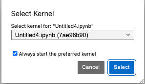
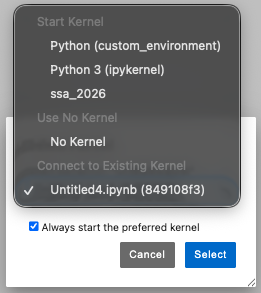
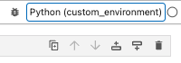

# Creating Your Own Python Environment in GeoLab

Python notebooks use packages that are collections of reusable code that perform tasks like process data, make maps, or analyze signals. Notebooks may need packages not available at run time. An **environment** is a way to keep all of packages organized in one tidy, self-contained workspace.

This guide shows you how to create your own environment in GeoLab.

---

## What Is a Package Manager?

GeoLab uses a tool called **conda** to install and manage packages. Think of conda like an app store for Python packages: you tell it what you want, it figures out what else is needed to make it work, and installs everything together.

> **Heads up:** GeoLab resets when you sign out, so any packages you installed during a session won't be there next time. The solution is to define your environment in a file (explained below) so you can recreate it anytime.

---

## See What's Already Installed

Open the **terminal** in GeoLab and try these commands to get your bearings.

**See all available environments:**

```bash
conda env list
```

The one with a `*` is the currently active environment:

```text
# conda environments:
#
base                  *  /srv/conda
notebook                 /srv/conda/envs/notebook
custom_environment       /home/jovyan/.conda/envs/custom_environment
```

**See all packages in the current environment:**

```bash
conda list
```

This prints a long list. Each row shows a package name, its version, and where it came from:

```text
# Name                    Version                   Build  Channel
cartopy                   0.24.1          py312h78ddc71_0    conda-forge
numpy                     2.2.4           py312h7e3fe57_0    conda-forge
obspy                     1.4.1           py312h7b8d3f4_0    conda-forge
xarray                    2025.3.0           pyhd8ed1ab_0    conda-forge
…
```

---

## Installing a Package Without Rebuilding

If you just need to add one or several packages, you can install it directly from inside a notebook cell using the line magic `%` command. This installs into the notebook's active environment:

```python
%conda install -c conda-forge pandas
```

Or, for packages only available on PyPI (a different package source):

```python
%pip install earthscope-sdk
```

> **Warning:** Installing with `%conda` inside a notebook can use a lot of memory. If your notebook becomes unresponsive or the kernel crashes, use the `environment.yml` approach instead, which is more reliable for larger installs.

---

## Create Your Own Environment

The best method to create a custom environment is to write a file that lists every package required. Conda reads the file and builds the environment from it. This ensures that it recreates the exact same environment. The file can be shared, making the environment reproducible.

### Step 1: Write an `environment.yml` File

Open an editor and create a new file called `environment.yml` and add the :

```yml
name: my_environment
channels:
  - conda-forge
dependencies:
  - python=3.11
  - ipykernel
  - numpy
  - matplotlib
  # Pip-specific packages
  - pip:
    - seisbench
```

Here's what each part means:

- **name**: What to call the environment.
- **channels**: Where to download packages from (`conda-forge` is a large, reliable source).
- **dependencies**: The packages to be installed installed.
- `ipykernel` is required so the environment can be used as a notebook kernel, always include it.
- `- pip:` installs packages only available in the PyPI repository

Replace `numpy`, `matplotlib`, or `seisbench` with the required packages.

### Step 2: Build the Environment

In the **terminal**, run:

```bash
conda env create -f environment.yml
```

Conda will figure out which versions of everything are compatible and download them. This can take a few minutes, which is normal.

> **If it fails:** Read the error message. Conda usually names the package that's causing the problem. Try removing it from the file or changing its version.

### Step 3: Activate the Environment

```bash
conda activate my_environment
```

Activating an environment switches the terminal into that workspace, any Python commands use that environment's packages. The terminal prompt will update to show the environment name, confirming it worked.

### Step 4: Register It as a Notebook Kernel

A new environment isn't automatically available in Jupyter notebooks. To use the newly created environment, it has to be registered. Run this command **in the terminal** to register it:

```bash
python -m ipykernel install --user --name my_environment --display-name "Python (my_environment)"
```

### Step 5: Switch to Your Environment in a Notebook

1. Open a notebook and go to **Kernel > Change Kernel…**

   

2. Select **Python (my_environment)**.

   

3. Check the upper-right corner of the notebook to confirm the kernel changed.

   

> **Note:** This must be done for each notebook separately. There isn't a way to set it as the default for all notebooks.

---

## Quick Reference for Environments

| What you want to do | Command |
| --- | --- |
| See all environments | `conda env list` |
| See installed packages | `conda list` |
| Activate an environment | `conda activate <name>` |
| Leave an environment | `conda deactivate` |
| Build from a file | `conda env create -f environment.yml` |
| Register as a kernel | `python -m ipykernel install --user --name <name> --display-name "<label>"` |
| Install a package (in notebook) | `%conda install <package>` |
| Install from PyPI (in notebook) | `%pip install <package>` |

---

## Installing Non-Python Software

Software that are not purely Python can be installed with either the Ubuntu package manger, `apt-get` or compiled from source.

### Installing Ubuntu Packages

Some software can be installed via the terminal using `apt-get`. Be advised that users cannot run commands as superusers, i.e., `sudo` will not work and permissions _cannot_ be granted to individual users. If you need to install something foundational, please create a [custom image](./building_custom_images.md).

### C/C++/Fortran Compilers

GeoLab images have `gcc`, `g++`, and `gfortran` installed. You will need to move the application source files to your home directory and compile them within GeoLab.