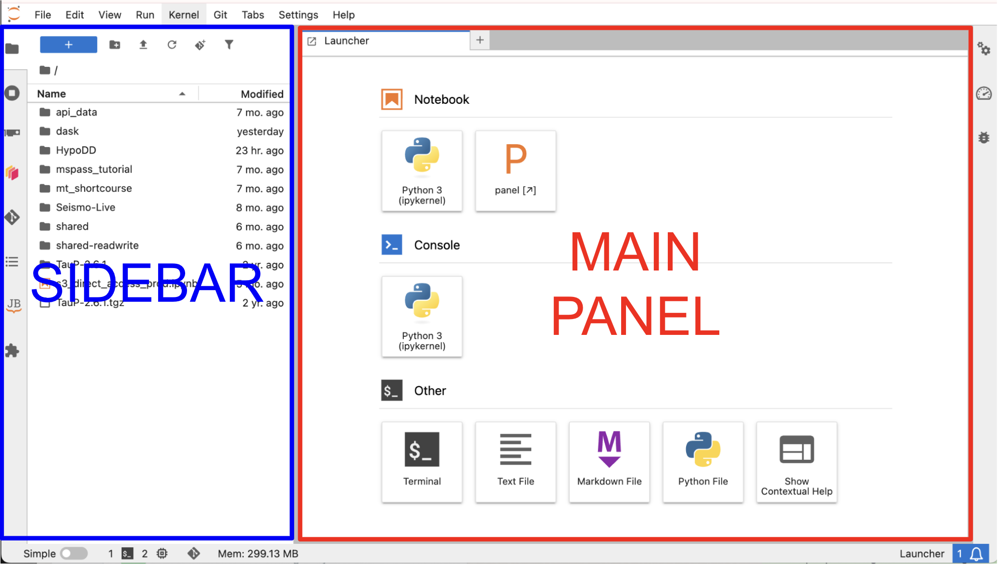
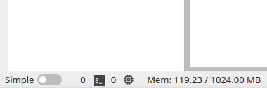

# Navigating GeoLab

GeoLab is designed to look and feel like a familiar python IDE. Here's a quick tour:

## Main Panel:
The Main Panel is home to the Launcher, where you can launch all of GeoLab's connected apps. From here, you can open new python notebooks, terminal consoles, and text/markdown files. Custom images may offer additional widgets here.

There are several ways to reach the Launcher:
- Click the blue **+** button in the top left of the sidebar 
- File &rarr; New Launcher
- Open a new tab in the main panel 

Like many IDEs, tabs within the main panel can be stacked or split-screen in multiple configurations. Simply click and drag each tab to reorganize your view. 

## Sidebar
The sidebar contains several tabs that will help you navigate the GeoLab environment and its extensions. Some images may contain extensions that differ from the ones described here. 

### File Browser
 The file browser points to your `/home/jovyan` directory, which persists across sessions regardless of which server options you select at login.

Please note that individual user storage limits are in place. You should treat your file system as a place to keep code while actively working on your workflow and analysis, but not for permanent storage. And unlike working on a local filesystem, the `/home` drive in GeoLab is not designed for handling raw data or intermediate data products. See [User Storage](./user_storage.md) for data retention policies and for more details on choosing the most efficient file management strategy for your workflow. 

At the top of the File Navigation Pane, you'll find familiar shortcuts to create new folders, upload files, refresh the file system navigation pane, clone a git repository (see [Using Git](./using_git.md)), and filter or search your files.

Standard file operations (i.e., rename, delete, copy, paste, open, etc) are available by right-clicking on a file/folder. 

### Usage Browser
 The usage browser allows you to toggle between all of your active tabs, python kernels, and workspaces — a quick way to stay organized and manage resources.

### Dask Dashboard
 [Dask](../advanced_topics/dask.md) is a parallelized compute framework. If it is activated in your environment, this panel lets you configure Dask workers and explore performance metrics.

### Git Dashboard
 The Git Dashboard provides visual, point-and-click control of your git repositories. See [Using Git](./using_git.md) for more details.

### Table of Contents
 The Table of Contents helps you navigate sections of a notebook or markdown files active in the main panel. Adding section headers to your notebooks lets you jump between sections quickly using this panel.

### JupyterBook Navigation
 Some cloned repositories may included JupyterBook documentation. Browse those docs here, without leaving GeoLab.

### JupyterLab Extension Manager
 Browse and install community-developed JupyterLab extensions.

## Footer

(resource-monitor)=
### Resource Monitor
Images with the jupyter-resource-usage extension installed allow you to view your resource utilization at the bottom status bar.

