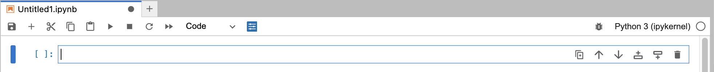

# Working with Notebooks

Jupyter Notebooks are interactive documents that combine live code, equations, visualizations, and narrative text. They are the primary way most users work in GeoLab.

## What is a Jupyter Notebook?

A notebook is made up of individual **cells** — each cell contains either executable code or formatted text (Markdown). You run cells one at a time, or all at once, and the output appears directly below each cell. This makes notebooks well-suited for exploratory data analysis, documentation, and sharing reproducible workflows.

## Opening and Creating Notebooks

GeoLab uses **JupyterLab**, a browser-based IDE. When you first log in, you'll land on the **Launcher**. From there, click **Python 3 (ipykernel)** under the Notebook heading to open a new, empty notebook.

There are several other ways to reach the Launcher:
- Click the blue **+** button in the top-left corner of the sidebar
- **File → New Launcher**

To open an existing notebook, navigate to it in the **File Browser** (folder icon in the sidebar) and double-click the `.ipynb` file.

See [Navigating GeoLab](./basic_navigation.md) for a full tour of the JupyterLab interface.

## Notebook Interface

When a notebook is open, you'll see three main areas:

- **Menu Bar** — options for File, Edit, View, Run, Kernel, and more
- **Toolbar** — quick-access buttons for saving, adding cells, running cells, and changing cell type
- **Cell area** — the main working area where you write and run code or text



## Cell Types

### Code Cells

Code cells run Python (or whichever language your kernel supports). Click a cell to select it, then run it with **Shift + Enter**. Output appears immediately below.

```python
print("Hello, GeoLab!")
```

### Markdown Cells

Markdown cells contain formatted text — useful for explaining your workflow, adding section headers, and documenting results. Change a cell to Markdown using the dropdown in the toolbar, or press **Esc then M** when a cell is selected.

See this [guide to Markdown Syntax](https://www.markdownguide.org/basic-syntax/) to help you format your Markdown Cells. 

Double-click a rendered Markdown cell to edit it. Run it again to render.

## Keyboard Shortcuts

| Shortcut | Action |
|---|---|
| `Shift + Enter` | Run cell, move to next |
| `Ctrl + Enter` | Run cell, stay in place |
| `Esc` | Enter command mode |
| `Esc then A` | Insert cell above |
| `Esc then B` | Insert cell below |
| `Esc then D, D` | Delete selected cell |
| `Esc then M` | Change cell to Markdown |
| `Esc then Y` | Change cell to code |
| `Ctrl + S` | Save notebook |

For the full list, go to **Help → Show Keyboard Shortcuts**.

## The Kernel

Notebooks don't run quite like python scripts. In a Python script, the interpreter runs your code top-to-bottom and exits. In a notebook, a **kernel** is the persistent Python process running in the background while your notebook is open. The kernel remembers every variable, function, and import from every cell you've run, in whatever order you ran them. This is the most important conceptual difference from scripting: **cell order on the page doesn't matter; execution order does.** 

### Kernel status
The kernel status indicator appears in the top-right corner of the notebook:
- **○ (empty circle)** — idle, ready to run
- **● (filled circle)** — busy, currently executing

Each cell also shows its execution status in brackets on the left:
- `[ ]` — not yet run this session
- `[*]` — currently running
- `[4]` — completed (number reflects execution order)

### Interrupting a running cell
If a cell is taking too long or stuck in a loop, stop it with **Kernel → Interrupt Kernel**, or press **I, I** in command mode. This is the notebook equivalent of `Ctrl+C` in a terminal. Your variables are preserved.

### Restarting the kernel
Restarting clears all variables and imports from memory, giving you a clean Python session. This is the fastest fix for unexpected behavior caused by running cells out of order.

| Action | Effect |
|---|---|
| **Kernel → Restart Kernel** | Clears memory; leaves cell outputs visible |
| **Kernel → Restart Kernel and Clear All Outputs** | Clears memory and output |
| **Kernel → Restart Kernel and Run All Cells** | Clears memory, then reruns the notebook top-to-bottom |

Use **Restart and Run All** before sharing a notebook to confirm it runs correctly in order.

### Shutting down kernels

Closing a notebook tab does **not** shut down the kernel — it keeps running in the background. When you're done with a notebook, shut down its kernel explicitly:

- While the notebook is open: **Kernel → Shut Down Kernel**
- From the  Usage Browser: find the kernel under **Running Kernels** and click **Shut Down**
- To stop all at once: **Kernel → Shut Down All Kernels**

## Saving Your Work

Jupyter autosaves periodically, but you should save manually before closing a notebook: **Ctrl + S**, or **File → Save Notebook**.

Notebooks are saved to your `/home/jovyan` directory and will persist between sessions. See [File Systems and Data Storage](./user_storage.md) for storage limits and best practices.

## Exporting Notebooks

To export a notebook to another format (HTML, PDF, etc.):

1. **File → Save and Export Notebook As...**
2. Select your desired format.

PDF export requires LaTeX to be available in your environment.

## Best Practices

- **Use Markdown cells** to explain your workflow and document your findings alongside your code.
- **Add section headers** using `#` headings — they enable the Table of Contents sidebar panel and make long notebooks easier to navigate.
- **Keep cells focused** — shorter cells are easier to debug and re-run.
- **Restart and run all before sharing** — use **Kernel → Restart Kernel and Run All Cells** to confirm your notebook runs cleanly from top to bottom.
- **Use Git** to version-control and share your notebooks. See [Using Git](./using_git.md).

## Troubleshooting

**Unexpected errors or stale variable values**
Restart the kernel: **Kernel → Restart Kernel**. This clears all variables and lets you start fresh. Re-run your cells from the top.

**Kernel appears stuck or unresponsive**
Try **Kernel → Interrupt Kernel** first. If that doesn't work, restart the kernel.

**Cluttered or very large cell output**
Right-click the output area and select **Clear Output**, or use **Edit → Clear All Outputs**.
Suppress a cell's outputs by adding `%%capture` to the beginning of the cell. 

**Wrong environment or missing packages**
Confirm you launched GeoLab with the correct environment. See [Launching your Server](./server_launch.md).
