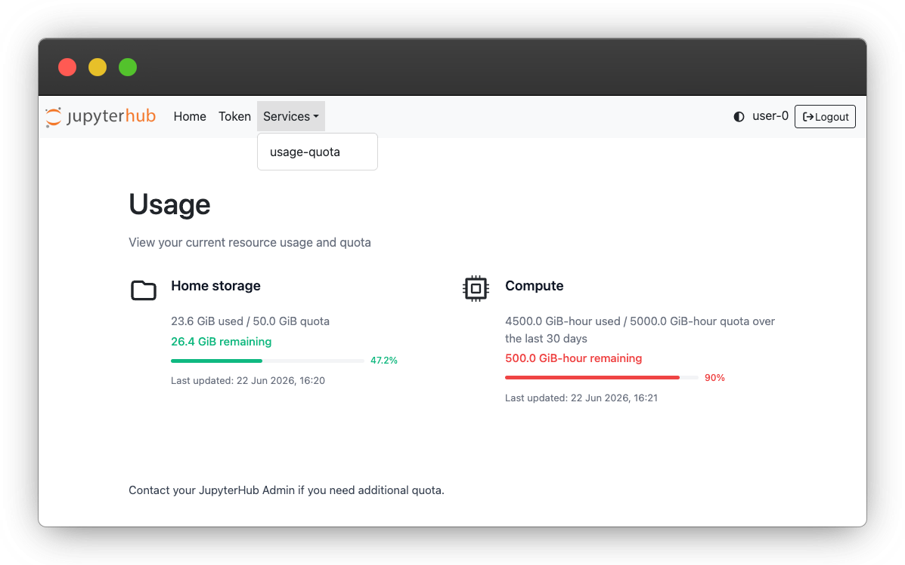

# Resource Quotas

Resource utilization quotas are implemented to provide fair access to compute resources and to ensure we can continue to operate GeoLab at no cost to users. 

## Checking Your Quota
You can check your storage and compute quota before launching a server by navigating to the __Services__ &rarr; __Usage Quota__ tab at the top left of the server launch page, or by navigating __File__ &rarr; __Hub Control Panel__ from within a GeoLab server.

## Storage
Each GeoLab user has access to 50GB of storage in their user home drive. See [File Systems and Data Storage](./user_storage.md) for strategies on managing your disk space. 

## Compute-Hours
Each GeoLab user is granted a number of compute hours to use on the platform. These quota levels are flexible based on your utilization patterns and enrollment in various EarthScope courses and workshops.

Compute hours are calculated based on your server size and the up-time of your server: 
- Running the default 4GB server for two hours will expend approximately 8GiB hours against your quota.
- Running a 29GB server for one hour will use 29GiB.

Compute hours represent real costs for the Facility, so please be mindful to use the smallest resources that make sense for the task at hand, and shut down your server when not in use.

Compute quotas are accrued and replenished over a rolling 30-day window. Please note that there is some delay between using compute time in GeoLab and it refreshing in the Usage Dashboard. 

### Requesting More Compute
We aim to provide a base level of resource access that meets most researchers' needs. If you are running out of compute quota credits and need to request more, please fill out the {{ resource_request_form }} with a thorough description of your project approach and compute needs.

## More information
See [2i2c's documentation of Usage Quotas](https://docs.2i2c.org/user/usage-quota-dashboard/) for more details on checking your resource utilization and remaining available compute.

