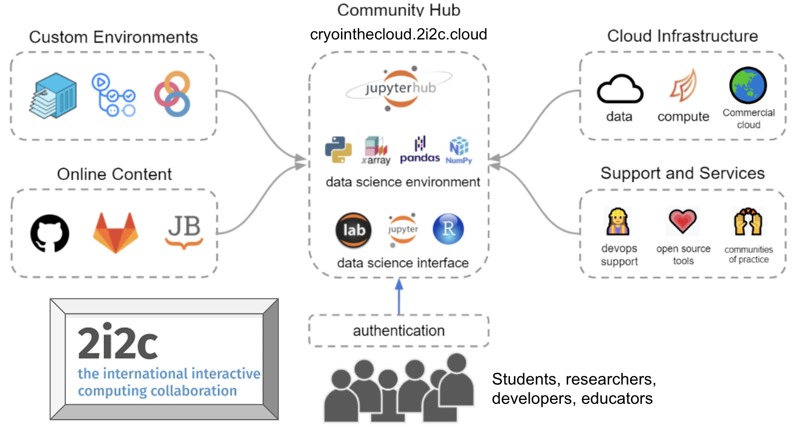

# About GeoLab

EarthScope Consortium is dedicated to supporting transformative global geophysical research and education. To this aim, GeoLab is a JupyterHub that offers a customizable, cloud-based compute environment to geophysical researchers and educators for data analysis and visualizations. 

GeoLab has been designed with analysis of geodetic and seismological data in mind, but it is not limited to these domains. Any research group looking to work with large, geophysical datasets or that would prefer not to maintain their own complicated compute environment could benefit from working in GeoLab.

Key Features of GeoLab:
* __Access to cloud compute resources at no cost to users:__ GeoLab is supported by federal grants from the National Science Foundation.
* __Scalable resources:__ Users can select from a variety of compute resources, including several options for RAM and CPU allocations. To keep costs down, users have access to a baseline compute environment by default; larger servers and GPU access require administrator approval. See [Resource Allocation](../getting_started/server_launch.md#select-your-resource-allocation) for further details.
* __Homogeneous compute environments:__ Creating identical compute environments is easy, ensuring that software versions are consistent from one user to another. This makes it an ideal platform for collaboration and as an educational tool.
* __Customizable environments:__ GeoLab is an ideal place to run python notebooks (.ipynb) in the cloud. Installing additional python packages and customizing environments using pip or conda environment files is trivial. More complex software installation is often possible using binderhub or a custom dockerfile. See [Environment Management](../advanced_topics/env_mgmt.md) for more details. 
* __Accessibility:__ Since GeoLab operates in the cloud, anyone with a web browser and reliable internet connection can use it, regardless of their own computer's operating system or tech specs.  
* __Data Adjacency:__ GeoLab runs adjacent to the NSF NGF [Data Repositories](https://www.earthscope.org/data/) in AWS (us-east2). This means that users can leverage low-latency, high-throughput access methods to analyze large volumes of data.

## Hub Management

The GeoLab platform is built and maintained by [International Interactive Computing Collaboration (2i2c)](https://www.2i2c.org), a non-profit organization that excels in using open-source tools to design and operate JupyterHubs for other institutions supporting research and education. An illustration of their community service model of bringing a community of users together into a shared compute instance focused on doing cutting-edge data science is shown below.

EarthScope and 2i2c work together to build open-source resources that allow research and education communities to take advantage of cloud computing, data intensive processing without data transfer, repeatable analysis and more.

